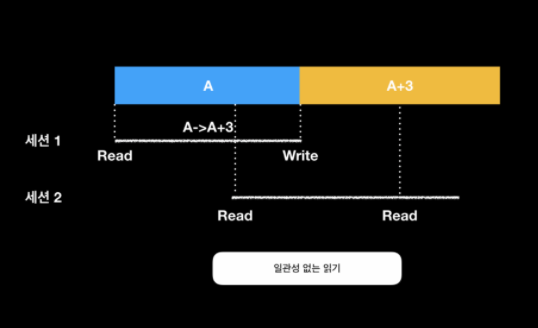

### 동시성 문제

두 개 이상의 세션이 공통된 자원에 대해 모두 읽고 쓰는 작업을 하려고 하는 경우 발생할 수 있는 문제

## 일관성 없는 읽기

## 손실되는 업데이트

~~~
Optional.empty(); 
Optional.of();
Optaionl.ofNullable();
~~~

### “Optional 적용 후 어떻게 null 체크를 해야하나요?”
“null 체크를 하실 필요가 없으시니 하시면 안 됩니다.”

https://www.daleseo.com/java8-optional-after/

참 정리를 잘 해두셨네요.

